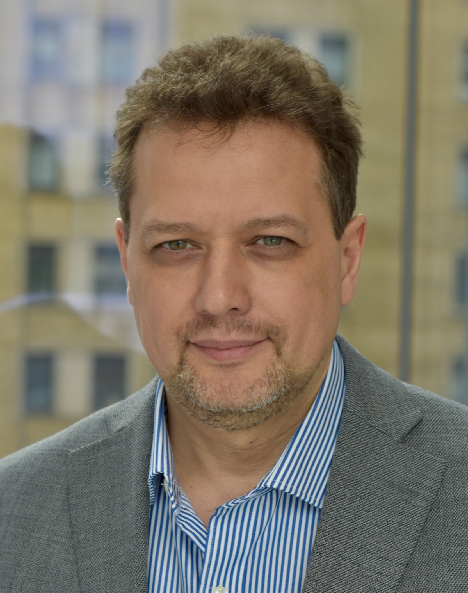

# Meet Your Faculty

#### David Wishart

>Distinguished Professor 
University of Alberta  
Edmonton, Alberta
>

Dr. David S. Wishart (PhD Yale, 1991) was born and raised in Edmonton and identifies as Metis. He is Fellow of the Royal Society of Canada. Since 1995, he has been a professor at the University of Alberta. Currently, he is a Distinguished University Professor in the Departments of Biological Sciences and Computing Science with adjunct appointments in the Faculty of Pharmaceutical Sciences and the Department of Pathology and Laboratory Medicine. His research interests are broad and include metabolomics, analytical chemistry, food chemistry, natural product chemistry, molecular biology, protein chemistry and neuroscience. He has developed several widely used techniques using NMR spectroscopy, mass spectrometry, liquid chromatography and gas chromatography to characterize the structures of both large and small molecules. He has led the “Human Metabolome Project” (HMP), a multi-university, multi-investigator project that catalogued >250,000 human metabolites in human tissues and biofluids.

#### Tanvir Sajed

<!--
>JOB TITLE  
INSTITUTION  
LOCATION
>
> --- CONTACT INFO, IF PROVIDED

BIO GOES HERE-->

#### Mark Berjanskii

>Research Associate / Co-Regional Coordinator of CBH Alberta  
University of Alberta  
Edmonton, Alberta
>

Mark received a Ph.D. in Biochemistry from the University of Missouri-Columbia, USA, in 2002, where he studied the structure and dynamics of oncoviral proteins with high-resolution NMR methods. Mark conducted his post-doctoral research of protein structural biology in University of Michigan, USA, and then joined Dr. Wishart’s group at University of Alberta, Canada, to work on data analysis and software development in the fields of metabolomics, NMR, and protein structure and dynamics.

<!--#### NAME

>JOB TITLE  
INSTITUTION  
LOCATION
>
> --- CONTACT INFO, IF PROVIDED

BIO GOES HERE-->

