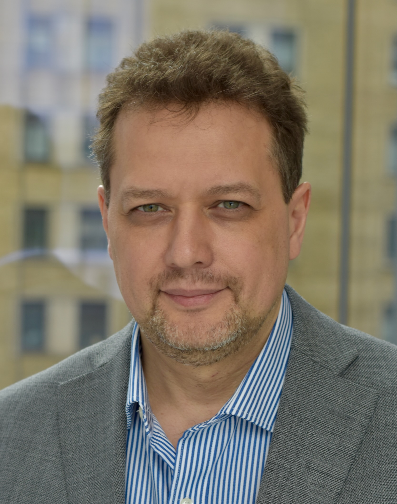
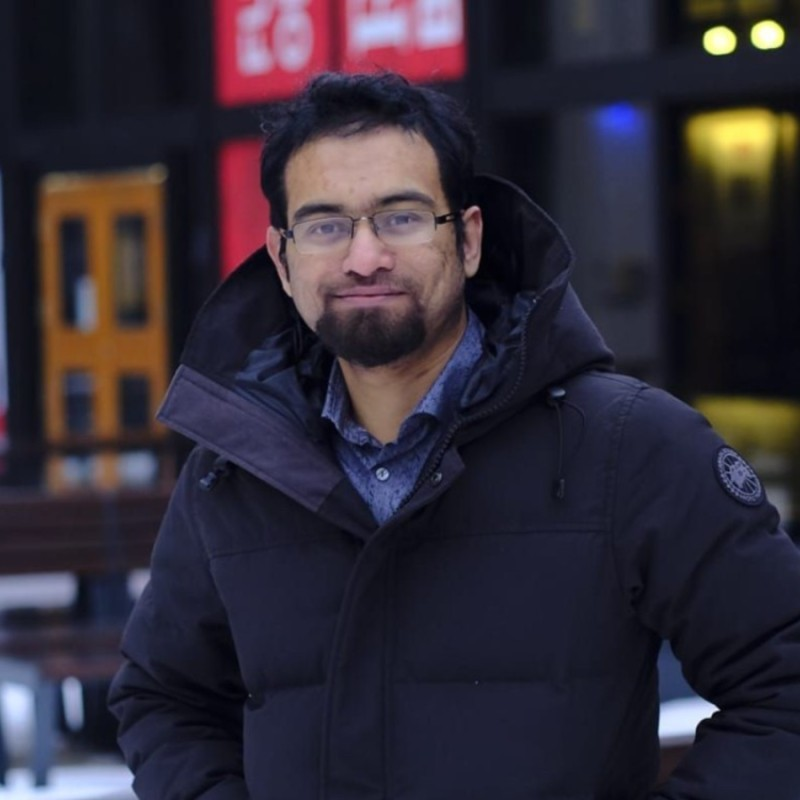
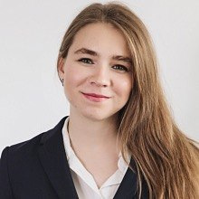

# Meet Your Faculty

#### David Wishart

>Distinguished Professor 
University of Alberta  
Edmonton, Alberta
>

Dr. David S. Wishart (PhD Yale, 1991) was born and raised in Edmonton and identifies as Metis. He is Fellow of the Royal Society of Canada. Since 1995, he has been a professor at the University of Alberta. Currently, he is a Distinguished University Professor in the Departments of Biological Sciences and Computing Science with adjunct appointments in the Faculty of Pharmaceutical Sciences and the Department of Pathology and Laboratory Medicine. His research interests are broad and include metabolomics, analytical chemistry, food chemistry, natural product chemistry, molecular biology, protein chemistry and neuroscience. He has developed several widely used techniques using NMR spectroscopy, mass spectrometry, liquid chromatography and gas chromatography to characterize the structures of both large and small molecules. He has led the “Human Metabolome Project” (HMP), a multi-university, multi-investigator project that catalogued >250,000 human metabolites in human tissues and biofluids.

#### Mark Berjanskii

>Research Associate / Co-Regional Coordinator of CBH Alberta  
University of Alberta  
Edmonton, Alberta
>

Mark received a Ph.D. in Biochemistry from the University of Missouri-Columbia, USA, in 2002, where he studied the structure and dynamics of oncoviral proteins with high-resolution NMR methods. Mark conducted his post-doctoral research of protein structural biology in University of Michigan, USA, and then joined Dr. Wishart’s group at University of Alberta, Canada, to work on data analysis and software development in the fields of metabolomics, NMR, and protein structure and dynamics.

#### Tanvir Sajed

>Doctoral Research Assistant  
University of British Columbia  
Vancouver, BC, Canada
>
> --- tsajed@gmail.com

Tanvir Sajed is a PhD student at the University of British Columbia with a background in machine learning, bioinformatics, and computational drug discovery. His work focuses on applying AI to large-scale virtual screening, molecular modeling, and chemical data analysis. He has contributed to research at the Wishart Lab, where he has worked on projects involving molecular data, NMR prediction, and AI-driven tools for chemical and biological analysis. He also gained industry experience at Huawei R&D, where he worked on applied AI and machine learning problems His broader interests include deep learning, graph neural networks, and scalable AI systems for scientific discovery.

#### Ekaterina Manskaia

>Doctoral Research Assistant  
University of British Columbia  
Vancouver, BC, Canada
>
> --- emanskaya@gmail.com

Ekaterina is a multidisciplinary professional with a blend of expertise in bioinformatics, computational chemistry, business analysis, and law. Currently, Ekaterina is pursuing a Doctoral degree in Bioinformatics at the University of British Columbia (UBC), where her research focuses on leveraging generative AI and machine learning to uncover new drug candidates for cancer and infectious diseases. Alongside her research, she has led projects in computational chemistry, managed complex data systems, and mentored students in Python programming, machine learning, and data science. She has recently published an open-source statistical analysis handbook. For the past few years, she has also been working as a Teaching Assistant in UBC’s Master of Data Science program.

#### Varinder Madhav Verma

>PhD Candidate  
University of Alberta  
Edmonton, Alberta, Canada
>
> --- varinde2@ualberta.ca

Varinder is a PhD candidate in the Department of Biological Sciences at the University of Alberta. His research centers on the development of advanced transcriptomic analysis pipelines and the integration of artificial intelligence into biomedical data workflows. He works extensively with diverse omics datasets, including bulk RNA-seq, 16S rRNA sequencing, single-cell RNA-seq, and proteomics to extract meaningful insights from complex biological systems.
Prior to his doctoral studies, Varinder completed a Master’s degree in Systems Biology and Bioinformatics, where he built a strong foundation in computational biology, multi-omics integration, and data-driven modeling of biological processes.

#### Ayla Chin

<!--
>JOB TITLE  
INSTITUTION  
LOCATION
>
> --- CONTACT INFO, IF PROVIDED

BIO GOES HERE-->

#### Kowen Woo

<!--
>JOB TITLE  
INSTITUTION  
LOCATION
>
> --- CONTACT INFO, IF PROVIDED

BIO GOES HERE-->
